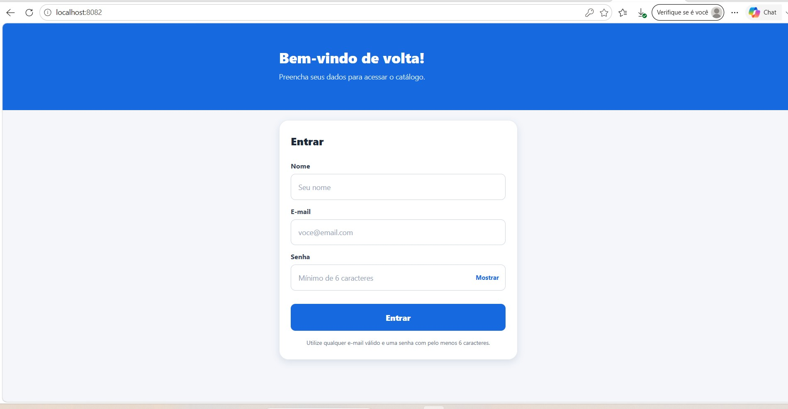
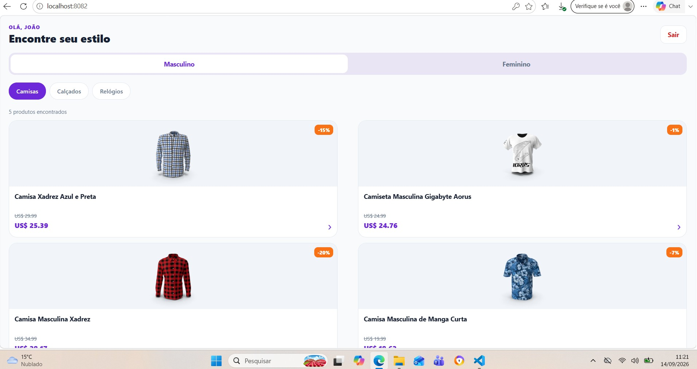
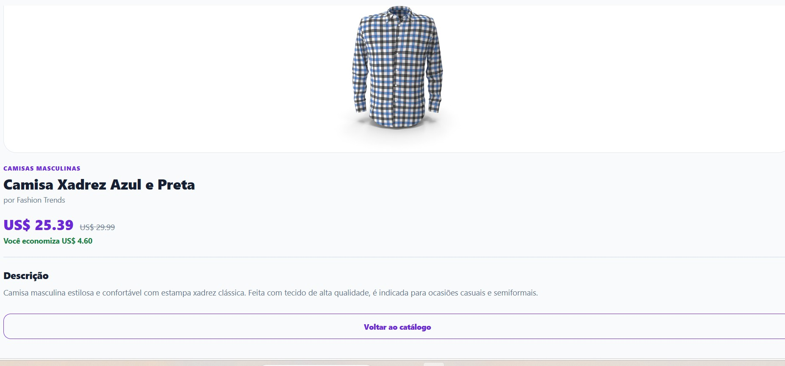
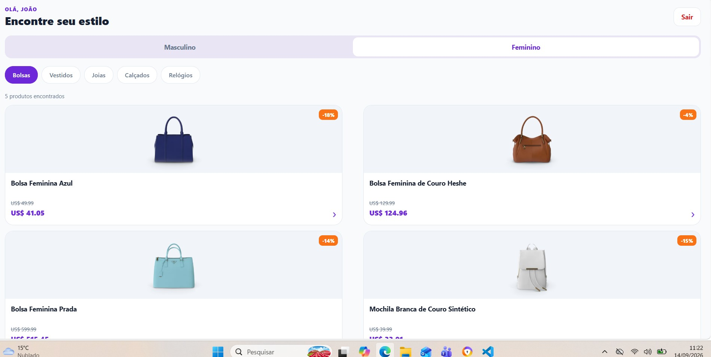
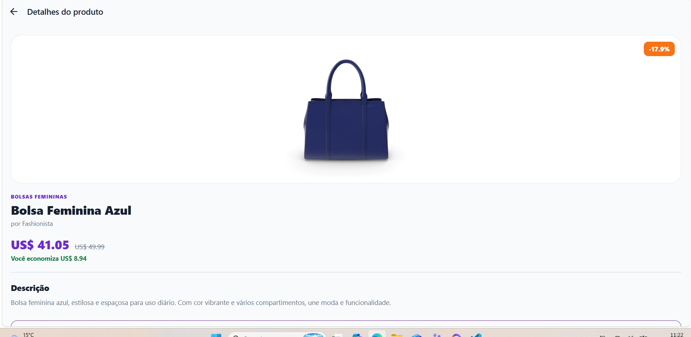
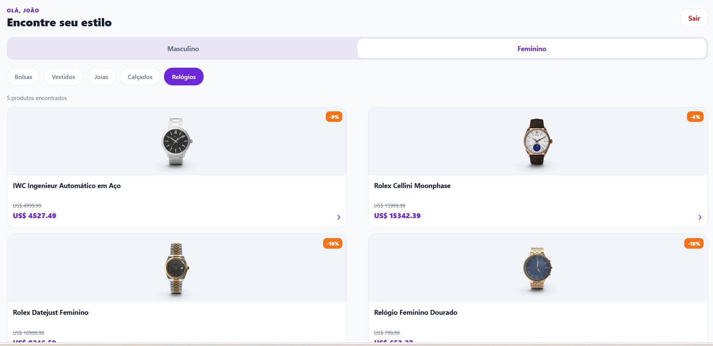
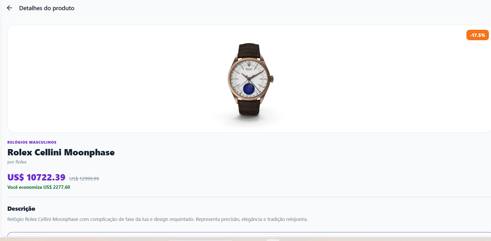
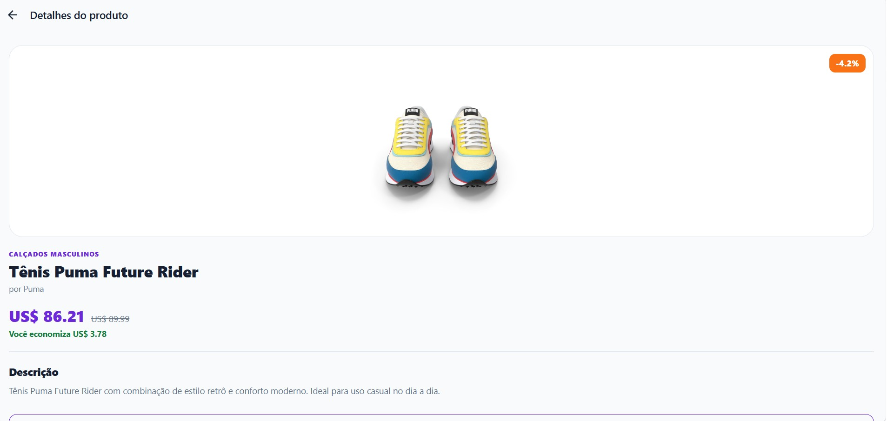

# Catálogo Interativo Mobile João

Aplicativo acadêmico em React Native com Expo que lista produtos de moda por categoria, consumindo a API DummyJSON.

## Funcionalidades

- Login demonstrativo com validação de nome, e-mail e senha
- Dados do usuário armazenados temporariamente no Redux Toolkit
- Catálogo separado entre produtos masculinos e femininos
- Todas as categorias solicitadas, com carregamento e tratamento de erros
- Tela de detalhes consultada pelo ID do produto
- Logout com limpeza dos dados do usuário

## Tecnologias

React Native, Expo, TypeScript, Axios, Redux Toolkit, React Redux e React Navigation.

## Como executar

Pré-requisitos: Node.js 18 ou 20 e Expo Go no celular (ou emulador configurado).

```bash
npm install
npx expo start
```

Leia o QR Code no Expo Go. O computador e o celular devem estar na mesma rede.

## Estrutura

```text
src/
  components/   Componentes reutilizáveis
  navigation/   Tipos das rotas
  presentation/ Textos de apresentação dos produtos em português
  screens/      Login, catálogo e detalhes
  services/     Cliente Axios e chamadas à DummyJSON
  store/        Configuração e autenticação Redux
  theme/        Paleta visual
  types/        Tipos da API
  utils/        Tratamento de erros
```

O login é uma simulação acadêmica e não envia credenciais a um servidor. Os dados permanecem apenas na memória durante o uso do aplicativo.

## Relatório de evidências

O PDF com os prints das telas e a breve explicação das funcionalidades está disponível em [docs/Projeto_Mobile_Relatorio_Prints_FINAL.pdf](docs/Projeto_Mobile_Relatorio_Prints_FINAL.pdf).

## Evidencias e prints do aplicativo

Os prints abaixo documentam os principais fluxos implementados no projeto.

### Login



### Catalogo masculino





### Catalogo feminino





### Preco, desconto e economia






